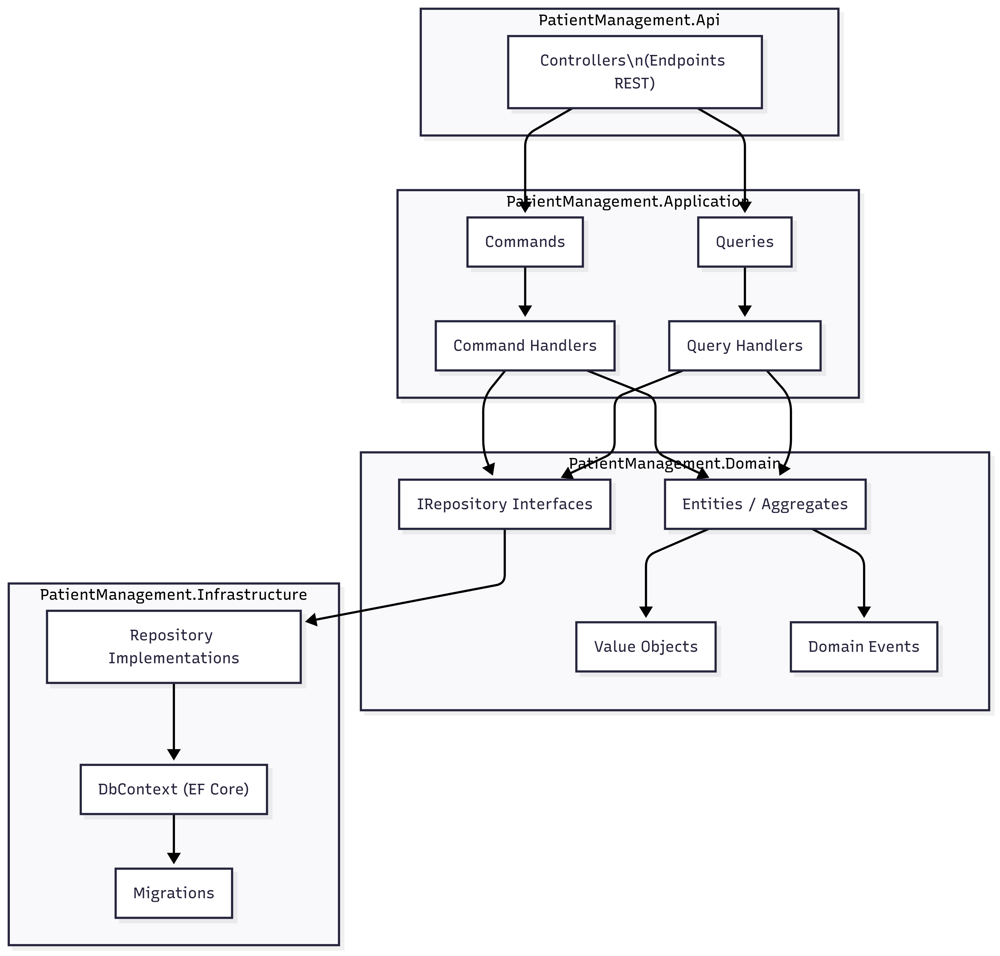
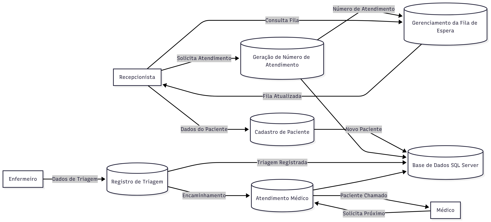

# 🏥 Patient Management API

API desenvolvida em **.NET 9** para gerenciamento de **pacientes, atendimentos e triagem clínica**.  
O projeto segue princípios de **Clean Architecture**, aplicando **CQRS (Command Query Responsibility Segregation)** sem uso de MediatR, e conta com repositórios baseados em Entity Framework Core.

---

## 📐 Arquitetura

A solução está organizada em camadas independentes para garantir separação de responsabilidades, testabilidade e escalabilidade.


### 🔹 Diagrama da Arquitetura (Mermaid)



### 🔹 Camadas

- **Domain**  
  Contém as **entidades de negócio**, **interfaces de repositórios** e **contratos genéricos** para `ICommandHandler` e `IQueryHandler`.

- **Application**  
  Implementa os **Use Cases** (CQRS: *Commands* e *Queries*), incluindo validações e regras de negócio.  
  Todos os outputs retornam através de um objeto padronizado (`Result<T>`) para garantir consistência e tratamento de erros.

- **Infrastructure**  
  Contém a implementação do **Entity Framework Core**, `DbContext`, Migrations e **Repositories**.

- **API**  
  Expõe os **endpoints REST**.  
  Utiliza **controllers enxutas** que se comunicam apenas com os **Handlers (CQRS)**.

---

## ⚙️ Fluxo de Trabalho e Regras de Negócio

### 🔹 Cadastro de Paciente
- O sistema permite registrar pacientes com:
  - Nome
  - Telefone
  - Sexo
  - E-mail
- Cada paciente recebe um **ID único**.

### 🔹 Fila de Atendimento
- Cada novo atendimento gera um **número sequencial de chamada**.
- O paciente é adicionado à **fila de espera**.
- A ordem de atendimento segue a **ordem de chegada**.

### 🔹 Triagem
- Antes da consulta, é feito o registro da triagem com:
  - Sintomas
  - Pressão arterial
  - Peso
  - Altura
  - Especialidade de encaminhamento

### 🔹 Regras
- Nenhum paciente pode ser atendido sem estar cadastrado.  
- O atendimento só ocorre após a triagem.  
- Pacientes são chamados **na ordem de chegada**, garantindo prioridade justa.  



---

## 🚀 Tecnologias Utilizadas

- [.NET 9](https://dotnet.microsoft.com/)  
- [Entity Framework Core](https://learn.microsoft.com/ef/core)  
- [SQL Server](https://www.microsoft.com/sql-server/)  
- CQRS sem MediatR (handlers próprios)  
- Injeção de Dependência nativa do .NET  
- Logging com `ILogger<T>`  

---

## 📊 Observabilidade

- Logging integrado com `ILogger<T>`.  
- Todas as operações críticas (cadastro, atualização, exclusão) são registradas no log.  
- Planejado suporte para **Health Checks** e **OpenTelemetry** (futuro).  

---

## 🔧 Execução do Projeto

```bash
# Restaurar dependências
dotnet restore

# Compilar solução
dotnet build

# Executar API
dotnet run --project src/PatientManagement.Api

https://localhost:7123/swagger

```
```bash
# Executa via docker comopose 
docker compose up -d --build
